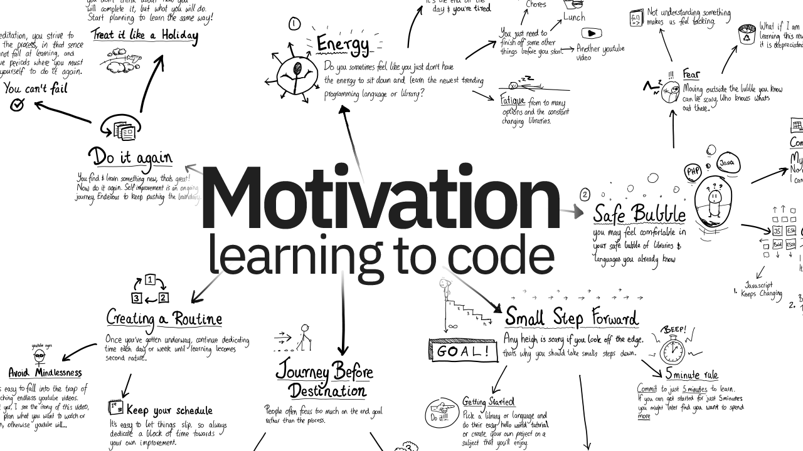

# Class 1 Notes 📃

## [1] **Getting Started**

- Compose a short poem describing how HTTP sends data between computers.

- Describe how HTML, CSS, and JS files are “parsed” in the browser.

- How can you find images to add to a Website?

- How do you create a String vs a Number in JavaScript?
What is a Variable and why are they important in JavaScript?

## [2] **Introduction to HTML**

- What is an HTML attribute?
Describe the Anatomy of an HTMl element.

- What is the Difference between <article> and <section> element tags?

- What Elements does a “typical” website include?

- How does metadata influence Search Engine Optimization?

- How is the <meta> HTML tag used when specifying metadata?

## [3] **Miscellaneous**

### *How to start to design a Website.*

- What is the first step to designing a Website?

- What is the most important question to answer when designing a Website?

### *Semantics*

- Why should you use an `<h1>` element over a `` element to display a top level heading?

- What are the benefits of using semantic tags in our HTML?

### *What is JavaScript?*

- Describe 2 things that require JavaScript in the Browser?

- How can you add JavaScript to an HTML document?

-----

Reference: 

[1] : [Getting Started](https://developer.mozilla.org/en-US/docs/Learn/Getting_started_with_the_web/)

[1] : [How the Web Works](https://developer.mozilla.org/en-US/docs/Learn/Getting_started_with_the_web/How_the_Web_works)

[1] : [Website Design and Process](https://developer.mozilla.org/en-US/docs/Learn/Getting_started_with_the_web/What_will_your_website_look_like)

[1] : [JavaScript Basics](https://developer.mozilla.org/en-US/docs/Learn/Getting_started_with_the_web/JavaScript_basics)

[2] : [Getting Started with HTML](https://developer.mozilla.org/en-US/docs/Learn/HTML/Introduction_to_HTML/Getting_started)

[2] : [HTML Document Structure](https://developer.mozilla.org/en-US/docs/Learn/HTML/Introduction_to_HTML/Document_and_website_structure)

[2] : [Metadata in HTML](https://developer.mozilla.org/en-US/docs/Learn/HTML/Introduction_to_HTML/The_head_metadata_in_HTML)

[3] : [How to start to design a Website](https://developer.mozilla.org/en-US/docs/Learn/Common_questions/Thinking_before_coding)

[3] : [Semantics](https://developer.mozilla.org/en-US/docs/Glossary/Semantics)

[3] : [What is JavaScript?](https://developer.mozilla.org/en-US/docs/Learn/JavaScript/First_steps/What_is_JavaScript)