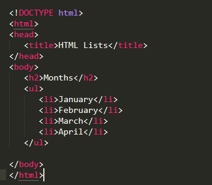
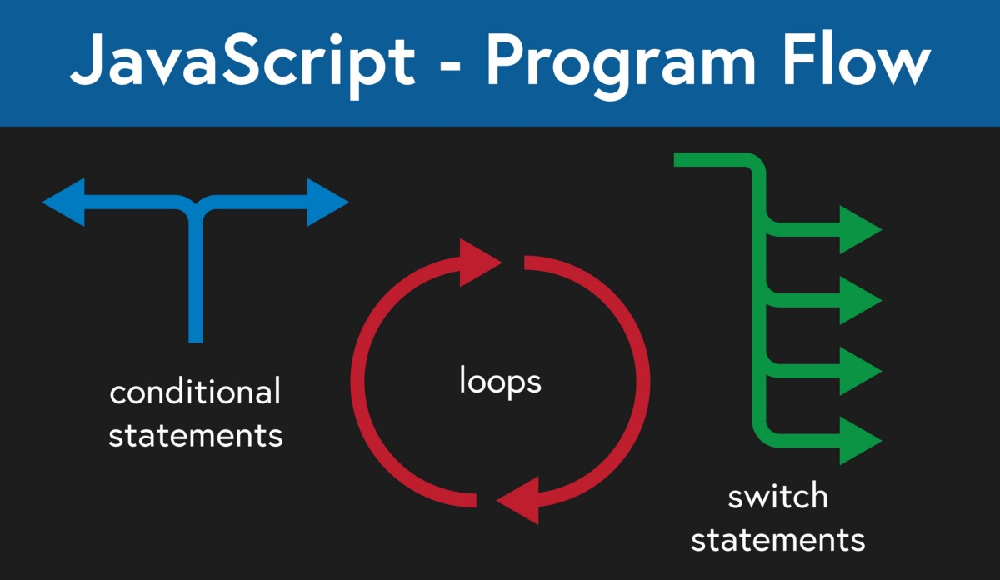

# Class 3 Notes

## **HTML Lists, Control FLow with JS, and the CSS Box Model**

### [1] <u>HTML</u>

- When should you use an unordered list in your HTML document?

    > If the order is not meaningful.

- How do you change the bullet style of unordered list items?

    > On CSS with `list-style-type`

- When should you use an ordered list vs an unorder list in your HTML document?

    > An ordered list is for when the order is meaningful like listing steps. Unordered lists are the opposite.

- Describe two ways you can change the numbers on list items provided by an ordered list?

    > By using, `reversed`, `start`, or `type`

### [2] <u>CSS</u>

- Describe the CSS properties of margin and padding as characters in a story. What is their role in a story titled: “The Box Model”?

    > Margin is the big bad wolf

    > Border is the house that protects the pigs from the big bad wolf

    > Padding are three little pigs inside

- List and describe the four parts of an HTML elements box as referred to by the box model.

    > Content box: The area where your content is displayed; size it using properties like inline-size and block-size or width and height.

    > Padding box: The padding sits around the content as white space; size it using padding and related properties.

    > Border box: The border box wraps the content and any padding; size it using border and related properties.

    > Margin box: The margin is the outermost layer, wrapping the content, padding, and border as whitespace between this box and other elements; size it using margin and related properties.

### [3] <u>JavaScript</u>

- What `data types` can you store inside of an `Array`?

    > List-like objects

- Is the `people` array a valid JavaScript array?

    > It is not because each `[]` listed needs to be in a separate variable.

`
const people = [['pete', 32, 'librarian', null], ['Smith', 40, 'accountant', 'fishing:hiking:rock_climbing'], ['bill', null, 'artist', null]];
`

- List five shorthand operators for assignment in javascript and describe what they do.

    > - x += f() addition

    > - x -= f() subtraction

    > - x *= f() multiplication

    > - x /= f() division

    > - x %= f() remainder

- Read the code below and evaluate the last expression and explain what the result would be and why.

    > This would result in an error because you cannot add a number and a string and a boolean.

---
let a = 10;
let b = 'dog';
let c = false;

evaluate this
(a + c) + b;

---

- Describe a real world example of when a conditional statement should be used in a JavaScript program.

    > Rock, papers, scissors game

    > If user shoots rock and the computer shoots paper then computer wins but if user shoots scissors then user would win.

- Give an example of when a Loop is useful in JavaScript.

    > When user input is needed but the user is not typing anything so you can send the user back to the prompt until something is typed down.

---

Reference:

[1] : [Learn HTML](https://developer.mozilla.org/en-US/docs/Web/HTML)

[1] : [Ordered Lists](https://developer.mozilla.org/en-US/docs/Web/HTML/Element/ol)

[1] : [Unordered Lists](https://developer.mozilla.org/en-US/docs/Web/HTML/Element/ul)

[2] : [Learn CSS](https://developer.mozilla.org/en-US/docs/Learn/CSS)

[2] : [The Box Model](https://developer.mozilla.org/en-US/docs/Learn/CSS/Building_blocks/The_box_model)
 
[3] : [Learn JS](https://developer.mozilla.org/en-US/docs/Learn/JavaScript)

[3] : [Arrays](https://developer.mozilla.org/en-US/docs/Learn/JavaScript/First_steps/Arrays)

[3] : [Operators and Expressions](https://developer.mozilla.org/en-US/docs/Web/JavaScript/Guide/Expressions_and_Operators)

[3] : [Conditionals](https://developer.mozilla.org/en-US/docs/Learn/JavaScript/Building_blocks/conditionals)

[3] : [Loops](https://developer.mozilla.org/en-US/docs/Learn/JavaScript/Building_blocks/Looping_code)