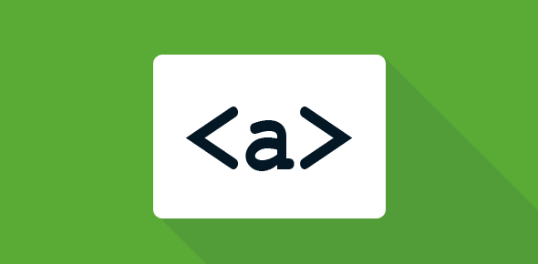

# Class 4 Notes

## **HTML Links, JS Functions, and Intro to CSS Layout**

### [1] <u>HTML</u>

- To create a basic link, we wrap text or other content inside what element?

- The href attribute contains what information?

- What are some ways we can ensure links on our pages are accessible to all readers?

### [2] <u>CSS</u>

- What is meant by “normal flow”?

- What are a few differences between block-level and inline elements?
- ___ positioning is the default for every html element.

- Name a few advantages to using absolute positioning on an element.

- What is a key difference between fixed positioning and absolute positioning?

### [3] <u>JavaScript</u>

- Describe the difference between a function declaration and a function invocation.

- What is the difference between a parameter and an argument?

### [4] <u>Miscellaneous</u>

- Pick 2 benefits to pair programming and reflect on how these benefits could help you on your coding journey.

-----
References:

[1] : [Learn HTML](https://developer.mozilla.org/en-US/docs/Learn/HTML)

[1] : [Creating Hyperlinks](https://developer.mozilla.org/en-US/docs/Learn/HTML/Introduction_to_HTML/Creating_hyperlinks)

[2] : [CSS Layout](https://developer.mozilla.org/en-US/docs/Learn/CSS/CSS_layout)

[2] : [CSS Layout: Normal Flow](https://developer.mozilla.org/en-US/docs/Learn/CSS/CSS_layout/Normal_Flow)

[2] : [CSS Layout: Positioning](https://developer.mozilla.org/en-US/docs/Learn/CSS/CSS_layout/Positioning)

[3] : [Learn JS](https://developer.mozilla.org/en-US/docs/Learn/JavaScript)

[3] : [Functions – Reusable Blocks of Code](https://developer.mozilla.org/en-US/docs/Learn/JavaScript/Building_blocks/Functions)

[4] : [6 Reasons for Pair Programming](https://www.codefellows.org/blog/6-reasons-for-pair-programming/)