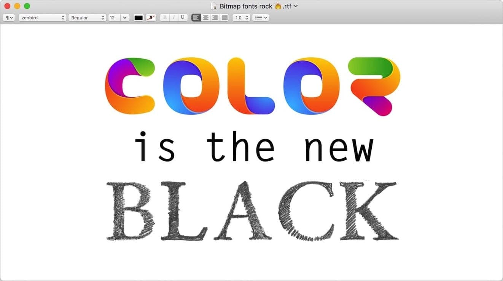

# Class 5 Notes

## **Images, Color, Text**

### [1] <u>HTML</u>

- What is a real world use case for the `alt` attribute being used in a website?

    > If the image isnt rendering, `alt` is used for text description in its place.

- How can you improve accessibility of images in an HTML document?

    > By having `alt` text.

- Provide an example of when the `figure` element would be useful in an HTML document.

    > The `figure` element is semantic so it would clearly link the figure to the caption.

- Describe the difference between a `gif` image and an `svg` image, pretend you are explaining to an elder in your community.

    > `gif` for simple images and animations

    > `svg` for user interface elements, icos, diagrams, etc.

- What image type would you use to display a screenshot on your website and why?

    > PNG because of precise reproduction of source images.

### [2] <u>CSS</u>

- Describe the difference between foreground and background colors of an HTML element, pretend you are talking to someone with no technical knowledge.

    > You take a picture of the trees with the mountains accompanying in the back. The trees are your foreground and the mountain is your background.

- Your friend asks you to give his colorless blog website a touch up. How would you use color to give his blog some character?

    > Changing the `color` of the text to anything other than black and change `text-decoraction` to anything other than the default.

- What should you consider when choosing fonts for an HTML document?

    > Use web safe fonts for compatability.

- What do font-size, font-weight, and font-style do to HTML text elements?

    > `font-size` determines the size

    >  `font-weight` determines the boldness of the text
        > normal or bold
        > lighter or bolder
        > A number between 100-900

    > `font-style` determines determines italic text
        > normal
        > italic
        > oblique

- Describe two ways you could add spacing around the characters displayed in an h1 element.

    > `letter-spacing` or `word-spacing`

-----
References:

[1] : [HTML Media](https://developer.mozilla.org/en-US/docs/Learn/HTML/Multimedia_and_embedding)

[1] : [Using Images In HTML](https://developer.mozilla.org/en-US/docs/Learn/HTML/Multimedia_and_embedding/Images_in_HTML)

[1] : [Common Image Types](https://developer.mozilla.org/en-US/docs/Web/Media/Formats/Image_types)

[1] : [Choosing Image Formats](https://developer.mozilla.org/en-US/docs/Web/Media/Formats/Image_types#choosing_an_image_format)

[2] : [Learn CSS](https://developer.mozilla.org/en-US/docs/Learn/CSS)

[2] : [Using Color in CSS](https://developer.mozilla.org/en-US/docs/Web/CSS/CSS_Colors/Applying_color)

[2] : [Styling HTML Text Elements](https://developer.mozilla.org/en-US/docs/Learn/CSS/Styling_text/Fundamentals)