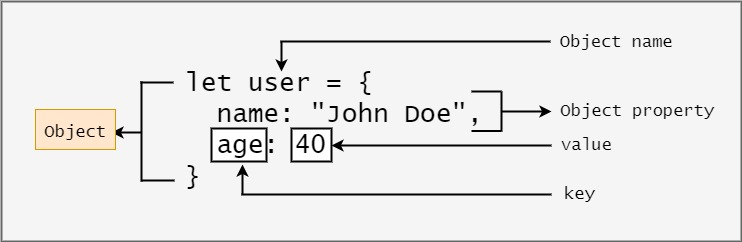

# Class 6 Notes

## **Problem Domain, Objects, and the DOM**

### [*JavaScript Object Basics*](https://developer.mozilla.org/en-US/docs/Learn/JavaScript/Objects/Basics)

- How would you describe an object to a non-technical friend you grew up with?

  > Everything related to you like your first name, last name, age, eye color
  > Or anythng related to a car like model, color, weight

  > 

- What are some advantages to creating object literals?

  > Code organization, won't pollute as much as functions, convienence/efficiency

- How do objects differ from arrays?

  > Arrays are more for lists in a single variable whilst objects represents characteristics(properties)

- Give an example for when you would need to use bracket notation to access an object’s property instead of dot notation.

  > If an object property holds a variable then you can't use dot notaion

- Evaluate the code below. What does the term `this` refer to and what is the advantage to using `this`?

``const dog = {
  name: 'Spot',
  age: 2,
  color: 'white with black spots',
  humanAge: function (){
    console.log(`${this.name} is ${this.age*7} in human years`);
  }
}``

  > The term `this` represents 'dog'. It is useful when creating more than one object from a single object definition.

### [*Introduction To The DOM*](https://developer.mozilla.org/en-US/docs/Web/API/Document_Object_Model/Introduction)

- What is the DOM?

  > The Document Object Model is the data representation of the objects that comprise the structure and content of a document on the web.

- Briefly describe the relationship between the DOM and JavaScript.

  > The DOM is the interface that defines how the browser reads your HTML document and allows JavaScript to manipulate the structure and style of your webpage.

--------------

❗❗❗ **Bookmark and Review** ❗❗❗

- [Understanding the problem domain is the hardest part of programming](http://simpleprogrammer.com/2013/07/15/understanding-the-problem-domain-is-the-hardest-part-of-programming)

- [What’s the difference between primitive values and object references in JavaScript?](https://betterprogramming.pub/intermediate-javascript-whats-the-difference-between-primitive-values-and-object-references-e863d70677b)