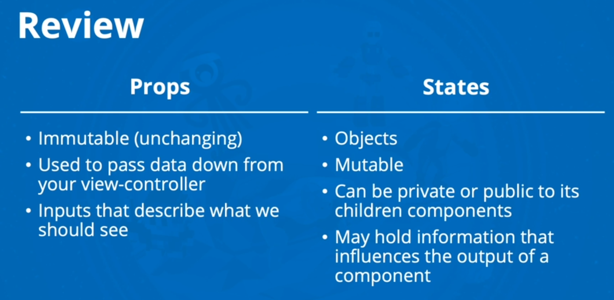

# Class 2 Notes

## State and Props

### [React lifecycle](https://medium.com/@joshuablankenshipnola/react-component-lifecycle-events-cb77e670a093)

1. Based off the diagram, what happens first, the ‘render’ or the ‘componentDidMount’?

- Render

1. What is the very first thing to happen in the lifecycle of React?

- Mounting

1. Put the following things in the order that they happen: `componentDidMount`, `render`, `constructor`, `componentWillUnmount`, `React Updates`

- `constructor`, `render`, `React Updates`, `componentDidMount`, `componentWillUnmount`

1. What does `componentDidMount` do?

- This method is invoked immediately after a component is mounted. If you need to load anything using a network request or initialize the DOM, it should go here. This method is a good place to set up any subscriptions. If you do that, don’t forget to unsubscribe in componentWillUnmount().

### [React State Vs Props](https://www.youtube.com/watch?v=IYvD9oBCuJI)

1. What types of things can you pass in the props?

- Any type of value, including strings, numbers, arrays, objects, functions, and even other React components.

1. What is the big difference between props and state?

- The key difference between props and state in React is that props are passed from a parent component to a child component, while state is managed within a component itself.

1. When do we re-render our application?

- React re-renders an application when there is a change in either props or state.

1. What are some examples of things that we could store in state?

- State is typically used to store data that can change over time within a component.

---

Bookmark and Review

- [React Docs - State and Lifecycle](https://reactjs.org/docs/state-and-lifecycle.html)

- [React Docs - handling events](https://reactjs.org/docs/handling-events.html)

- [React Tutorial through ‘Developer Tools’](https://reactjs.org/tutorial/tutorial.html)

- [React Bootstrap Documentation](https://react-bootstrap.github.io/)

- [Boootstrap Cheatsheet](https://getbootstrap.com/docs/5.0/examples/cheatsheet/)

- [Bootstrap Shuffle - a class “sandbox”](https://bootstrapshuffle.com/classes)

- [Netlify](https://www.netlify.com/)