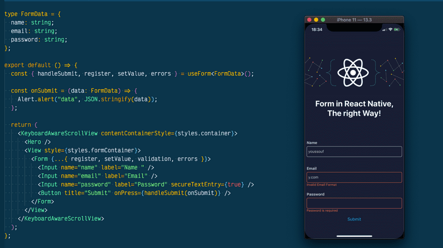

# Class 4 Notes

## React and Forms

### [React Docs - Forms](https://reactjs.org/docs/forms.html)

1. What is a ‘Controlled Component’?

  - In React, a "controlled component" is a component where the value of an input field is controlled by React's state, rather than the input field itself.

1. Should we wait to store the users responses from the form into state when they submit the form OR should we update the state with their responses as soon as they enter them? Why.

  - It's generally recommended to update the state with the user's responses as soon as they enter them, rather than waiting until they submit the form.

1. How do we target what the user is entering if we have an event handler on an input field?

  - To target what the user is entering in an input field, we can use the onChange event handler to capture the input field's value as the user types.

### [The Conditional (Ternary) Operator Explained](https://codeburst.io/javascript-the-conditional-ternary-operator-explained-cac7218beeff)

1. Why would we use a ternary operator?

  - A ternary operator is a shorthand way to write an if/else statement

1. Rewrite the following statement using a ternary statement:

`` 
if(x===y){
  console.log(true);
} else {
  console.log(false);
}
``

  - `console.log(x === y ? true : false);`

--- 

Bookmark and Review

- [React Bootstrap - Forms](https://react-bootstrap.github.io/forms/overview/)

- [React Docs - conditional rendering](https://reactjs.org/docs/conditional-rendering.html)