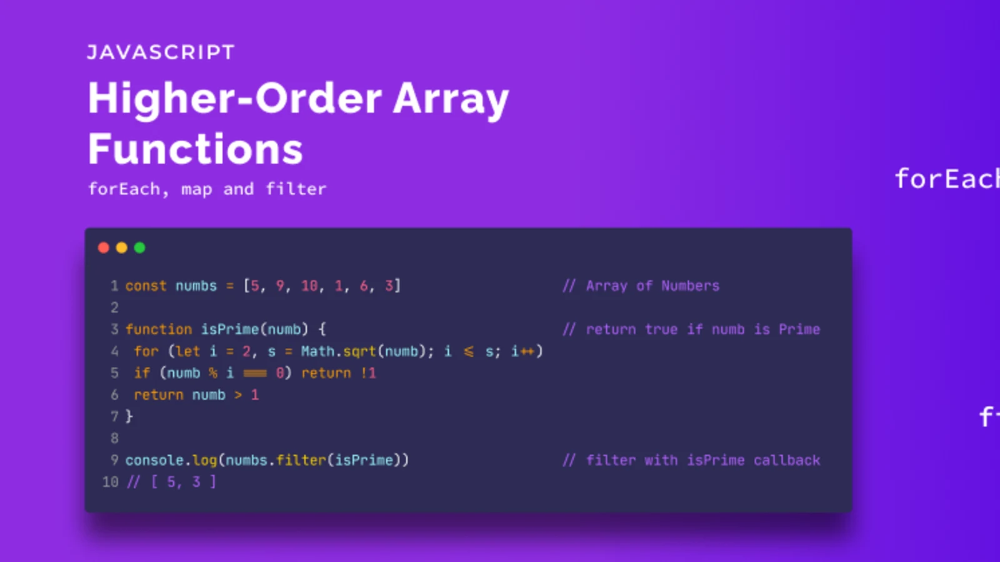

# Class 5 Notes

## Putting it all together

### [React Docs - Thinking in React](https://reactjs.org/docs/thinking-in-react.html)

1. What is the `single responsibility principle` and how does it apply to components?

    - The single responsibility principle is a programming principle that states that a component or module should have only one responsibility, and that responsibility should be entirely encapsulated by that component or module.

1. What does it mean to build a ‘static’ version of your application?

    - Building a 'static' version of an application means creating a version of the application that only displays data and UI elements without any interactivity or dynamic behavior.

1. Once you have a static application, what do you need to add?

    - Interactivity

1. What are the three questions you can ask to determine if something is state?

    - Does it change over time?

    - Can it be calculated from other state or props in the component?

    - Can it be passed down from a parent component via props?

1. How can you identify where state needs to live?

    - To identify where state needs to live in a React component, we can ask ourselves which component(s) need to be aware of the state data and which component(s) need to modify it.

### [Higher-Order Functions](https://eloquentjavascript.net/05_higher_order.html#h_xxCc98lOBK)

1. What is a “higher-order function”?

    - A higher-order function is a function that takes one or more functions as arguments, or returns a function as its result.

1. Explore the `greaterThan` function as defined in the reading. In your own words, what is line 2 of this function doing?

    - On line 2 of the `greaterThan` function, a new function is defined using the arrow function syntax. This new function takes a number as its input and returns either true or false depending on whether the input number is greater than the original number that was passed to the greaterThan function.

1. Explain how either `map` or `reduce` operates, with regards to higher-order functions.

    - Both `map` and `reduce` are higher-order functions in JavaScript that operate on arrays. `map` takes a function as its argument, and applies that function to each element of the array, returning a new array with the results.